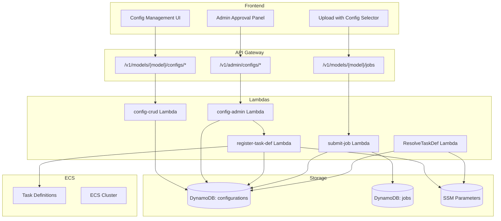
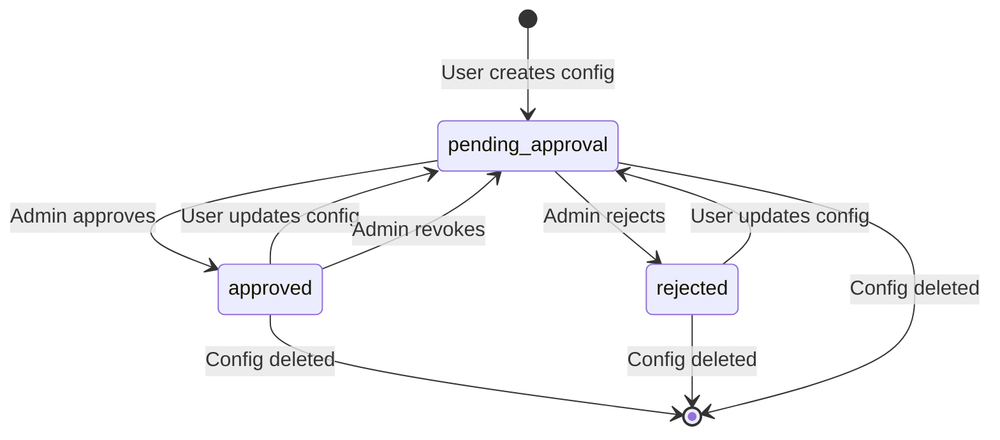

# Design Document: User-Configurable Model Parameters

## Overview

This design document describes the architecture and implementation for the User-Configurable Model Parameters feature. The feature enables users to create custom configurations that override both inference-level parameters (prompts, output formats) and infrastructure-level parameters (CPU, memory, GPU). All configurations require admin approval before use.

The system follows a two-tier parameter model:
1. **Inference Parameters** - Passed via container environment variables at runtime (no new task definition needed)
2. **Infrastructure Parameters** - Require new ECS task definition registration

### Key Design Decisions

1. **Admin Approval Required**: All configurations must be approved by an admin before use to ensure resource governance
2. **Dynamic Task Definition Generation**: Task definitions are registered via Lambda (not CDK) to enable user customization
3. **Rust Lambda Functions**: Following project patterns, user-facing Lambdas are in Rust; task definition registration uses Python for boto3 simplicity
4. **SSM-Based Configuration**: Base task definitions are read from SSM, consistent with existing model stack patterns

## Architecture



### Approval Workflow



## Components and Interfaces

### 1. Config CRUD Lambda (Rust)

**Purpose**: Handle user configuration create, read, update, delete operations.

**Location**: `backend/lambdas/config-crud/`

**Interface**:
```rust
// Request types
struct CreateConfigRequest {
    name: String,
    description: Option<String>,
    inference_params: Option<InferenceParams>,
    infra_params: Option<InfraParams>,
    visibility: Option<String>, // "private" | "public"
}

struct InferenceParams {
    prompt: Option<String>,
    output_format: Option<String>,
    custom_env_vars: Option<HashMap<String, String>>,
}

struct InfraParams {
    cpu: Option<u32>,
    memory_mib: Option<u32>,
    gpu_count: Option<u32>,
    timeout_minutes: Option<u32>,
    ephemeral_storage_gib: Option<u32>,
    ebs_volume_size_gb: Option<u32>,
    spot_enabled: Option<bool>,
}

// Response types
struct ConfigResponse {
    config_id: String,
    user_id: String,
    model: String,
    name: String,
    description: Option<String>,
    created_at: String,
    updated_at: String,
    inference_params: InferenceParams,
    infra_params: InfraParams,
    approval_status: String,
    approved_by: Option<String>,
    approved_at: Option<String>,
    rejection_reason: Option<String>,
    task_definition_arn: Option<String>,
    task_definition_status: Option<String>,
    visibility: String,
    usage_count: u64,
    forked_from: Option<String>,
}
```

**Endpoints**:
- `POST /v1/models/{model}/configs` - Create configuration
- `GET /v1/models/{model}/configs` - List user's configurations
- `GET /v1/models/{model}/configs/{config_id}` - Get configuration
- `PUT /v1/models/{model}/configs/{config_id}` - Update configuration
- `DELETE /v1/models/{model}/configs/{config_id}` - Delete configuration
- `POST /v1/models/{model}/configs/{config_id}/fork` - Fork configuration
- `GET /v1/configs/discover` - Discover public configurations

### 2. Config Admin Lambda (Rust)

**Purpose**: Handle admin approval, rejection, and revocation operations.

**Location**: `backend/lambdas/config-admin/`

**Interface**:
```rust
struct ApproveRequest {
    // No body required
}

struct RejectRequest {
    reason: String,
}

struct RevokeRequest {
    // No body required
}
```

**Endpoints**:
- `GET /v1/admin/configs/pending` - List pending configurations
- `POST /v1/admin/configs/{config_id}/approve` - Approve configuration
- `POST /v1/admin/configs/{config_id}/reject` - Reject configuration
- `POST /v1/admin/configs/{config_id}/revoke` - Revoke configuration

**Admin Verification**:
```rust
fn is_admin(claims: &Claims) -> bool {
    claims.cognito_groups
        .as_ref()
        .map(|groups| groups.contains(&"pdf-models-admins".to_string()))
        .unwrap_or(false)
}
```

### 3. Register Task Definition Lambda (Python)

**Purpose**: Register ECS task definitions when configurations are approved.

**Location**: `backend/lambdas/register-task-def/`

**Why Python**: boto3's ECS `register_task_definition` API is complex with many parameters. Python provides simpler dictionary manipulation than Rust's strongly-typed approach for this one-off operation.

**Interface**:
```python
def handler(event, context):
    """
    Event: {
        "config_id": "uuid",
        "model": "marker",
        "infra_params": {
            "cpu": 4096,
            "memory_mib": 16384,
            ...
        }
    }
    
    Returns: {
        "task_definition_arn": "arn:aws:ecs:...",
        "status": "active" | "failed",
        "error": "optional error message"
    }
    """
```

**Task Definition Derivation**:
1. Read base task definition ARN from SSM: `/pdf-models/{model}/task-definition-arn`
2. Describe the base task definition via ECS API
3. Modify CPU, memory, GPU, storage based on config
4. Register new task definition with family: `pdf-models-{model}-user-{config_id[:8]}`
5. Return new task definition ARN

### 4. Modified Submit Job Lambda

**Changes to existing `backend/lambdas/submit-job/`**:

```rust
struct SubmitJobBody {
    s3_input_key: Option<String>,
    start_processing: bool,
    prompt: Option<String>,
    original_filename: Option<String>,
    config_id: Option<String>,  // NEW: optional configuration ID
}
```

**Validation Logic**:
```rust
if let Some(config_id) = &body.config_id {
    // Fetch configuration from DynamoDB
    let config = get_config(config_id).await?;
    
    // Verify approval status
    if config.approval_status != "approved" {
        return Err(Error::BadRequest("Configuration not approved"));
    }
    
    // Verify access (owner, shared, or public)
    if !has_access(&config, user_id) {
        return Err(Error::Forbidden("No access to configuration"));
    }
    
    // Pass config_id to Step Functions
    execution_input["config_id"] = config_id;
}
```

### 5. Modified ResolveTaskDef Lambda

**Changes to existing Lambda in `model_stack.py`**:

```python
def handler(event, context):
    ssm = boto3.client('ssm')
    dynamodb = boto3.resource('dynamodb')
    
    config_id = event.get('config_id')
    
    if config_id:
        # Fetch configuration from DynamoDB
        table = dynamodb.Table('pdf-models-configurations')
        config = table.get_item(Key={'config_id': config_id})['Item']
        
        # Use custom task definition ARN
        task_def_arn = config['task_definition_arn']
        
        # Merge inference params into environment
        inference_params = config.get('inference_params', {})
        prompt = inference_params.get('prompt', event.get('prompt', ''))
        
        return {
            **event,
            'task_definition_arn': task_def_arn,
            'prompt': prompt,
            'custom_env_vars': inference_params.get('custom_env_vars', {})
        }
    else:
        # Existing behavior: read from SSM
        response = ssm.get_parameter(Name=f'/pdf-models/{model_name}/task-definition-arn')
        task_def_arn = response['Parameter']['Value']
        
        return {
            **event,
            'task_definition_arn': task_def_arn,
            'prompt': event.get('prompt', '')
        }
```

## Data Models

### DynamoDB Table: pdf-models-configurations

**Table Structure**:
```
Table Name: pdf-models-configurations
Partition Key: config_id (String, UUID)

Global Secondary Indexes:
1. user_id-created_at-index
   - Partition Key: user_id
   - Sort Key: created_at
   - Projection: ALL

2. visibility-model-index
   - Partition Key: visibility
   - Sort Key: model
   - Projection: ALL
```

**Item Schema**:
```json
{
  "config_id": "550e8400-e29b-41d4-a716-446655440000",
  "user_id": "74f87488-6071-7034-6f34-e23c3bca23fa",
  "model": "marker",
  "name": "High Memory Marker",
  "description": "Marker with 32GB memory for large documents",
  "created_at": "2024-01-15T10:30:00Z",
  "updated_at": "2024-01-15T10:30:00Z",
  
  "inference_params": {
    "prompt": "Convert to clean markdown",
    "output_format": "markdown",
    "custom_env_vars": {
      "MAX_PAGES": "100"
    }
  },
  
  "infra_params": {
    "cpu": 4096,
    "memory_mib": 32768,
    "gpu_count": 0,
    "timeout_minutes": 60,
    "ephemeral_storage_gib": 50,
    "ebs_volume_size_gb": null,
    "spot_enabled": false
  },
  
  "approval_status": "approved",
  "approved_by": "admin-user-id",
  "approved_at": "2024-01-15T11:00:00Z",
  "rejection_reason": null,
  
  "task_definition_arn": "arn:aws:ecs:us-east-1:123456789:task-definition/pdf-models-marker-user-550e8400:1",
  "task_definition_status": "active",
  
  "visibility": "private",
  "org_id": null,
  
  "usage_count": 42,
  "forked_from": null
}
```

### Cognito Admin Group

**Group Name**: `pdf-models-admins`

**JWT Claims** (when user is in group):
```json
{
  "sub": "user-uuid",
  "cognito:groups": ["pdf-models-admins"],
  ...
}
```

### Parameter Validation Rules

**Fargate CPU/Memory Combinations**:
```rust
const VALID_FARGATE_CONFIGS: &[(u32, &[u32])] = &[
    (256, &[512, 1024, 2048]),
    (512, &[1024, 2048, 3072, 4096]),
    (1024, &[2048, 3072, 4096, 5120, 6144, 7168, 8192]),
    (2048, &[4096, 5120, 6144, 7168, 8192, 9216, 10240, 11264, 12288, 13312, 14336, 15360, 16384]),
    (4096, &[8192, 9216, 10240, 11264, 12288, 13312, 14336, 15360, 16384, 17408, 18432, 19456, 20480, 21504, 22528, 23552, 24576, 25600, 26624, 27648, 28672, 29696, 30720]),
    (8192, &[16384, 20480, 24576, 28672, 32768, 36864, 40960, 45056, 49152, 53248, 57344, 61440]),
    (16384, &[32768, 40960, 49152, 57344, 65536, 73728, 81920, 90112, 98304, 106496, 114688, 122880]),
];

fn validate_fargate_config(cpu: u32, memory_mib: u32) -> Result<(), ValidationError> {
    for (valid_cpu, valid_memories) in VALID_FARGATE_CONFIGS {
        if cpu == *valid_cpu && valid_memories.contains(&memory_mib) {
            return Ok(());
        }
    }
    Err(ValidationError::InvalidCpuMemoryCombination)
}
```

**Other Validation Rules**:
```rust
fn validate_infra_params(params: &InfraParams, use_gpu: bool) -> Result<(), ValidationError> {
    if let Some(gpu_count) = params.gpu_count {
        if gpu_count > 4 {
            return Err(ValidationError::GpuCountTooHigh);
        }
    }
    
    if let Some(timeout) = params.timeout_minutes {
        if timeout < 1 || timeout > 180 {
            return Err(ValidationError::InvalidTimeout);
        }
    }
    
    if let Some(storage) = params.ephemeral_storage_gib {
        if storage < 21 || storage > 200 {
            return Err(ValidationError::InvalidEphemeralStorage);
        }
    }
    
    if let Some(ebs) = params.ebs_volume_size_gb {
        if ebs < 30 || ebs > 500 {
            return Err(ValidationError::InvalidEbsVolume);
        }
    }
    
    Ok(())
}
```

## Correctness Properties


*A property is a characteristic or behavior that should hold true across all valid executions of a system—essentially, a formal statement about what the system should do. Properties serve as the bridge between human-readable specifications and machine-verifiable correctness guarantees.*

### Property 1: Configuration Round-Trip Consistency

*For any* valid configuration with inference parameters and infrastructure parameters, creating the configuration and then reading it back SHALL return equivalent values for all fields including nested objects.

**Validates: Requirements 1.4, 1.5, 1.6**

### Property 2: New Configurations Start Pending

*For any* configuration creation request with valid parameters, the resulting configuration SHALL have `approval_status` set to `pending_approval`.

**Validates: Requirements 2.1**

### Property 3: User Listing Returns Only Owned Configurations

*For any* user and any set of configurations in the system, calling the list endpoint SHALL return exactly those configurations where `user_id` matches the requesting user and `model` matches the requested model.

**Validates: Requirements 2.2**

### Property 4: Access Control Enforcement

*For any* user and any configuration, access SHALL be granted if and only if: (user is owner) OR (user is in shared_with list) OR (configuration is public AND approval_status is approved).

**Validates: Requirements 2.3, 6.2**

### Property 5: Update Resets Approval Status

*For any* configuration with `approval_status` of `approved`, updating any field SHALL result in `approval_status` being reset to `pending_approval` and `task_definition_arn` being cleared.

**Validates: Requirements 2.4**

### Property 6: Owner Can Delete Configuration

*For any* configuration owned by a user, a delete request from that user SHALL succeed and the configuration SHALL no longer exist in the system.

**Validates: Requirements 2.5**

### Property 7: Non-Owner Modification Forbidden

*For any* user and any configuration they do not own, modification attempts (update or delete) SHALL return a 403 Forbidden error.

**Validates: Requirements 2.6**

### Property 8: Parameter Validation

*For any* infrastructure parameter values:
- CPU values outside {256, 512, 1024, 2048, 4096, 8192, 16384} for Fargate or outside 1-96 for EC2 SHALL be rejected
- Memory values that don't match valid Fargate CPU/memory combinations SHALL be rejected
- GPU count outside 0-4 SHALL be rejected
- Timeout outside 1-180 minutes SHALL be rejected
- Ephemeral storage outside 21-200 GiB SHALL be rejected
- EBS volume size outside 30-500 GB SHALL be rejected

**Validates: Requirements 3.1, 3.2, 3.3, 3.4, 3.5, 3.6, 3.7**

### Property 9: Pending Configurations Listing

*For any* set of configurations in the system, the admin pending endpoint SHALL return exactly those configurations where `approval_status` equals `pending_approval`.

**Validates: Requirements 4.1**

### Property 10: Approval State Transitions

*For any* configuration:
- Approving a pending configuration SHALL set `approval_status` to `approved`, record `approved_by` and `approved_at`
- Rejecting a pending configuration SHALL set `approval_status` to `rejected` and record `rejection_reason`
- Revoking an approved configuration SHALL set `approval_status` to `pending_approval` and clear `task_definition_arn`

**Validates: Requirements 4.2, 4.3, 4.4**

### Property 11: Admin Authorization

*For any* user without the `pdf-models-admins` group in their JWT claims, all admin endpoint calls SHALL return 403 Forbidden.

**Validates: Requirements 4.5, 9.2**

### Property 12: Task Definition Naming Convention

*For any* model name and config_id, the registered task definition family SHALL follow the pattern `pdf-models-{model}-user-{config_id[:8]}`.

**Validates: Requirements 5.3**

### Property 13: Task Definition Status Updates

*For any* task definition registration:
- On success, `task_definition_arn` SHALL be set and `task_definition_status` SHALL be `active`
- On failure, `task_definition_status` SHALL be `failed` and error message SHALL be recorded

**Validates: Requirements 5.4, 5.5**

### Property 14: Job Submission Requires Approved Configuration

*For any* job submission with a `config_id`, the job SHALL only be accepted if the configuration has `approval_status` of `approved`. Non-approved configurations SHALL result in 400 Bad Request.

**Validates: Requirements 6.1, 6.3**

### Property 15: Configuration Passed to Step Functions

*For any* job submitted with a `config_id`, the Step Functions execution input SHALL contain the `config_id` field.

**Validates: Requirements 6.4**

### Property 16: ResolveTaskDef Uses Configuration

*For any* Step Functions execution with `config_id` in the input:
- The resolved `task_definition_arn` SHALL come from the configuration's `task_definition_arn` field
- The configuration's `inference_params` SHALL be merged into container environment overrides

**Validates: Requirements 6.5, 6.6**

### Property 17: Discover Returns Public Approved Configurations

*For any* set of configurations, the discover endpoint SHALL return exactly those configurations where `visibility` equals `public` AND `approval_status` equals `approved`.

**Validates: Requirements 7.1**

### Property 18: Fork Creates Pending Copy

*For any* fork operation on an accessible configuration:
- A new configuration SHALL be created with the forking user as owner
- The new configuration SHALL have `approval_status` of `pending_approval`
- The new configuration SHALL have `forked_from` set to the original configuration ID

**Validates: Requirements 7.2, 7.3**

### Property 19: Usage Count Increment

*For any* job successfully submitted with a `config_id`, the configuration's `usage_count` SHALL be incremented by 1.

**Validates: Requirements 7.4**

### Property 20: Visibility Setting

*For any* configuration creation or update with a `visibility` value of `private` or `public`, the stored configuration SHALL have that exact visibility value.

**Validates: Requirements 7.5**

### Property 21: Configuration Limits Enforcement

*For any* user:
- Creating a configuration when the user has 10+ configurations for that model SHALL fail with 400 Bad Request
- Creating a configuration when the user has 50+ total configurations SHALL fail with 400 Bad Request
- All configurations regardless of `approval_status` SHALL count toward limits

**Validates: Requirements 8.1, 8.2, 8.3, 8.4**

## Error Handling

### API Error Responses

All Lambda functions return consistent error responses:

```json
{
  "statusCode": 400 | 403 | 404 | 500,
  "body": {
    "error": "Error message",
    "details": ["Specific validation error 1", "Specific validation error 2"]
  }
}
```

### Error Categories

| Status Code | Scenario |
|-------------|----------|
| 400 | Invalid parameters, validation failures, limit exceeded, non-approved config |
| 403 | Not owner, not admin, no access to config |
| 404 | Configuration not found |
| 500 | Internal error, task definition registration failure |

### Task Definition Registration Errors

The Register_Task_Def_Lambda handles these error scenarios:

1. **Base task definition not found**: SSM parameter missing or invalid
2. **ECS API error**: Task definition registration fails
3. **Invalid parameters**: CPU/memory combination not supported by ECS

On any error, the configuration is updated with:
```json
{
  "task_definition_status": "failed",
  "task_definition_error": "Detailed error message"
}
```

### Retry Strategy

- Config CRUD operations: No automatic retry (client should retry)
- Task definition registration: 3 retries with exponential backoff
- DynamoDB operations: SDK default retry behavior

## Project-Specific Notes

**CRITICAL**: Before starting any task, read `AGENTS.md` and `Makefile` to understand project conventions:

1. **AWS Profile Requirement**: ALL AWS and CDK commands MUST be prefixed with `AWS_PROFILE=arch`
   ```bash
   # Correct
   AWS_PROFILE=arch aws s3 ls
   AWS_PROFILE=arch uv run cdk deploy
   
   # Wrong - will fail or use wrong account
   aws s3 ls
   cdk deploy
   ```

2. **Python/CDK Commands**: Use `uv run` for all Python/CDK commands
   ```bash
   uv run cdk synth
   uv run python -m pytest
   ```

3. **Deployment**: Use `make pipeline-start` for deployments (not manual cdk deploy)

4. **Lambda Code Changes**: Must be committed and pushed to CodeCommit before CodeBuild will see them

5. **Stack Communication**: Use SSM Parameter Store (not CloudFormation exports)

## Testing Strategy

### Dual Testing Approach

This feature requires both unit tests and property-based tests:

- **Unit tests**: Specific examples, edge cases, error conditions, integration points
- **Property tests**: Universal properties across all valid inputs

### Property-Based Testing Configuration

**Library**: `proptest` for Rust, `hypothesis` for Python

**Configuration**:
- Minimum 100 iterations per property test
- Each test tagged with: `Feature: user-configurable-model-parameters, Property {N}: {title}`

### Unit Test Coverage

| Component | Test Focus |
|-----------|------------|
| Config CRUD Lambda | CRUD operations, access control, validation |
| Config Admin Lambda | Admin verification, state transitions |
| Register Task Def Lambda | Task definition derivation, ECS API mocking |
| Submit Job Lambda | Config validation, Step Functions input |
| ResolveTaskDef Lambda | Config lookup, environment merging |

### Property Test Coverage

| Property | Generator Strategy |
|----------|-------------------|
| Round-trip | Random valid configurations |
| Access control | Random users, configs, visibility combinations |
| Parameter validation | Random parameter values including edge cases |
| State transitions | Random approval status sequences |
| Limits | Random user with varying config counts |

### Integration Tests

1. **End-to-end approval flow**: Create config → Admin approve → Submit job with config
2. **Rejection flow**: Create → Reject → Edit → Resubmit → Approve
3. **Fork flow**: Create public config → Approve → Another user forks → New pending config

### Test Commands

```bash
# Unit tests
make test

# Integration tests (cloud)
make test-integration-cloud

# Property tests (local)
cd backend/lambdas && cargo test --features proptest
```
