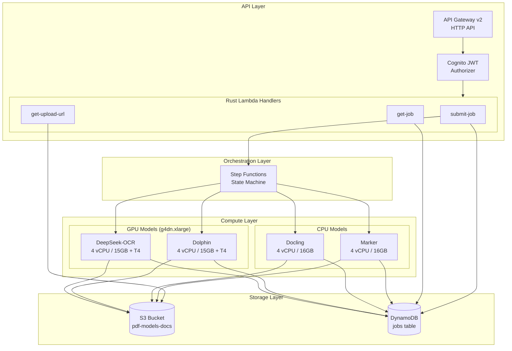
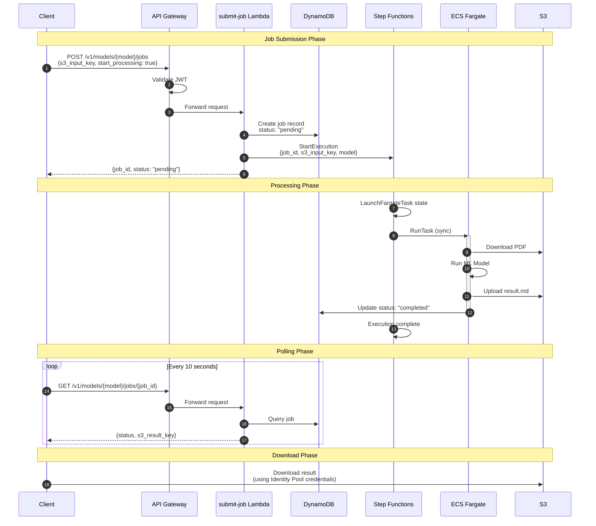
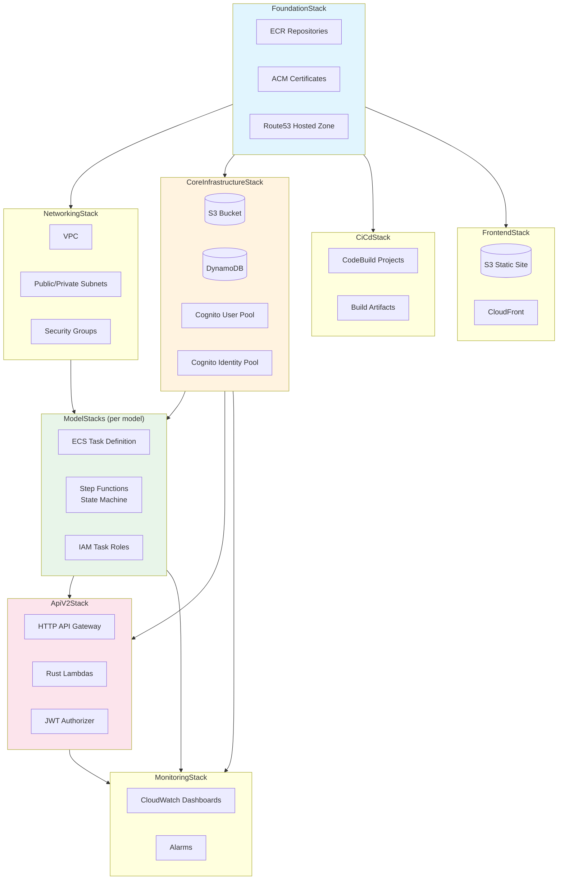
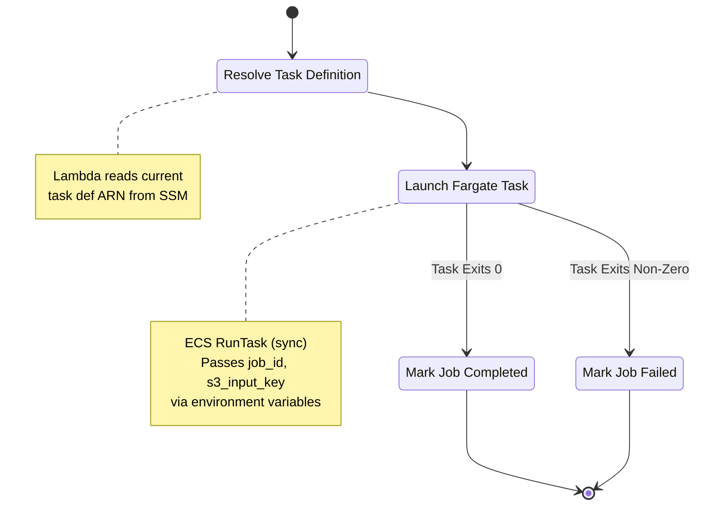
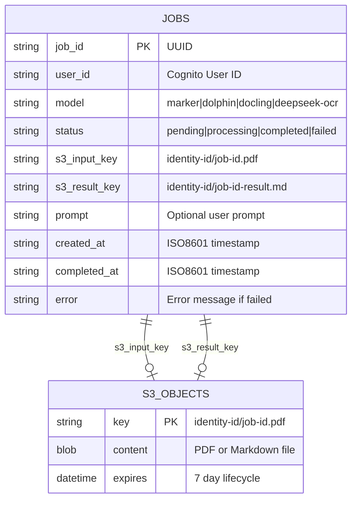
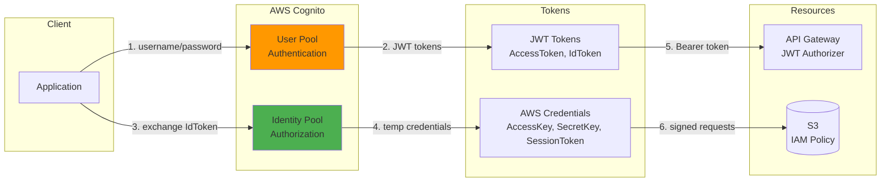
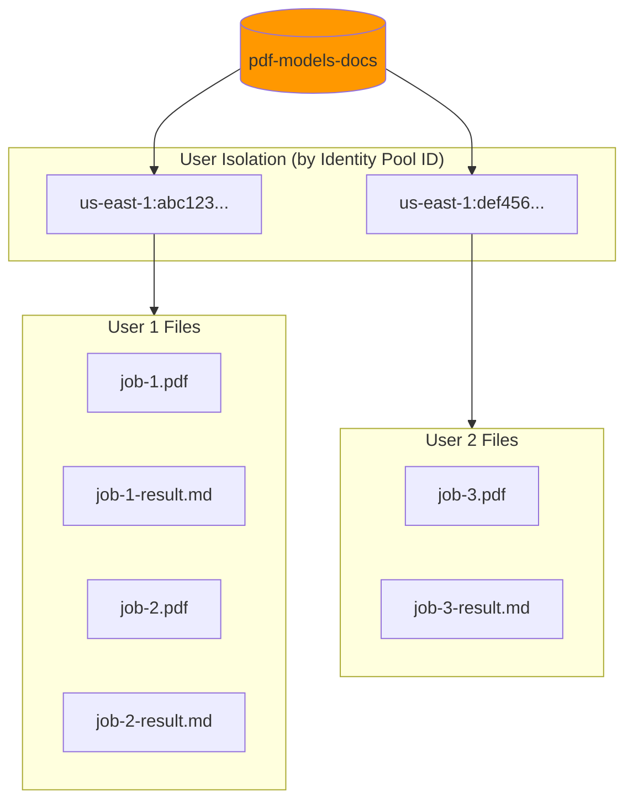
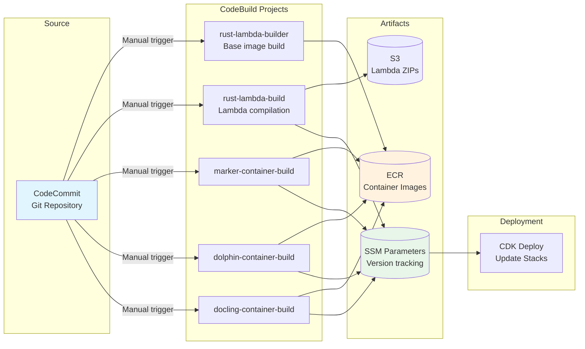
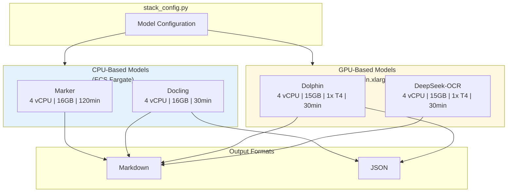
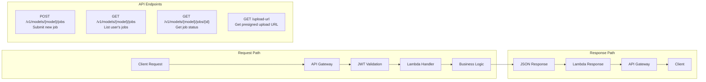

# Architecture Diagrams

This document contains Mermaid diagrams for visualizing the PDF Models backend architecture.

Generated SVG files are available in the `diagrams/` subdirectory:

| Diagram | File |
|---------|------|
| System Overview | [01-system-overview.svg](diagrams/01-system-overview.svg) |
| Job Processing Flow | [02-job-processing-flow.svg](diagrams/02-job-processing-flow.svg) |
| CDK Stack Dependencies | [03-cdk-stack-dependencies.svg](diagrams/03-cdk-stack-dependencies.svg) |
| Step Functions State Machine | [04-step-functions-state-machine.svg](diagrams/04-step-functions-state-machine.svg) |
| Data Model | [05-data-model.svg](diagrams/05-data-model.svg) |
| Authentication Architecture | [06-authentication-architecture.svg](diagrams/06-authentication-architecture.svg) |
| S3 Bucket Structure | [07-s3-bucket-structure.svg](diagrams/07-s3-bucket-structure.svg) |
| CI/CD Pipeline | [08-cicd-pipeline.svg](diagrams/08-cicd-pipeline.svg) |
| Model Configuration | [09-model-configuration.svg](diagrams/09-model-configuration.svg) |
| Request/Response Flow | [10-request-response-flow.svg](diagrams/10-request-response-flow.svg) |

## System Overview

## Job Processing Flow

## CDK Stack Dependencies

## Step Functions State Machine

## Data Model

## Authentication Architecture

## S3 Bucket Structure

## CI/CD Pipeline

## Model Configuration

## Request/Response Flow

